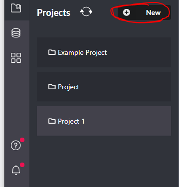
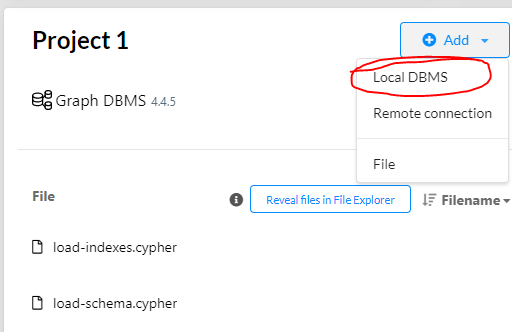
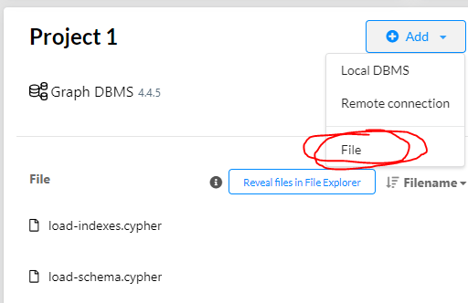
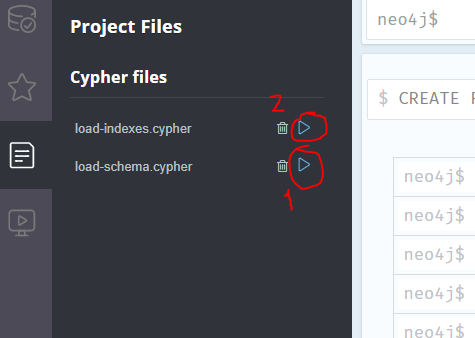

# Data & Schema migration

## How to setup the information database

1. Make sure you have downloaded and installed Neo4J desktop. Available here: [Neo4J](https://neo4j.com/download/)
2. Create a new project:

   

3. Add local DBMS:

   

4. Choose version 4.5.4. Choose password, make sure you have the same password in `../backend/InformationApplication/src/main/resources/application.properties` if you want to run the API as well.

5. Add the files from this folder, `jsonDb.json`, `load-schema.cypher` and `load-indexes.cypher` to the database:

   

6. Open the database in Neo4j Browser and run the files:

   

7. Enter following commands to load the database:

```
CALL apoc.load.json("jsonDb.json", {});
```
